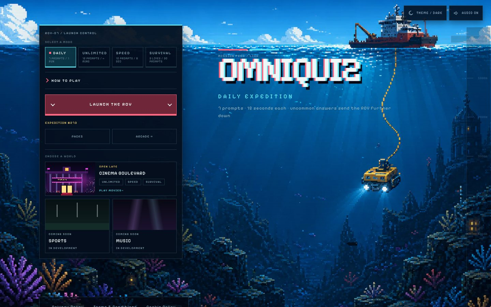
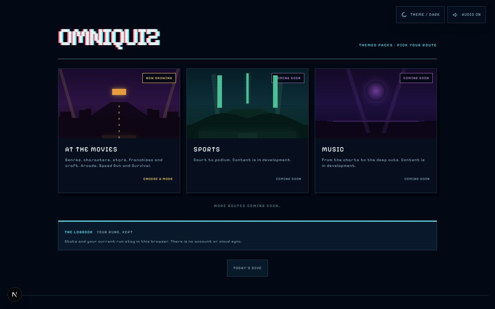
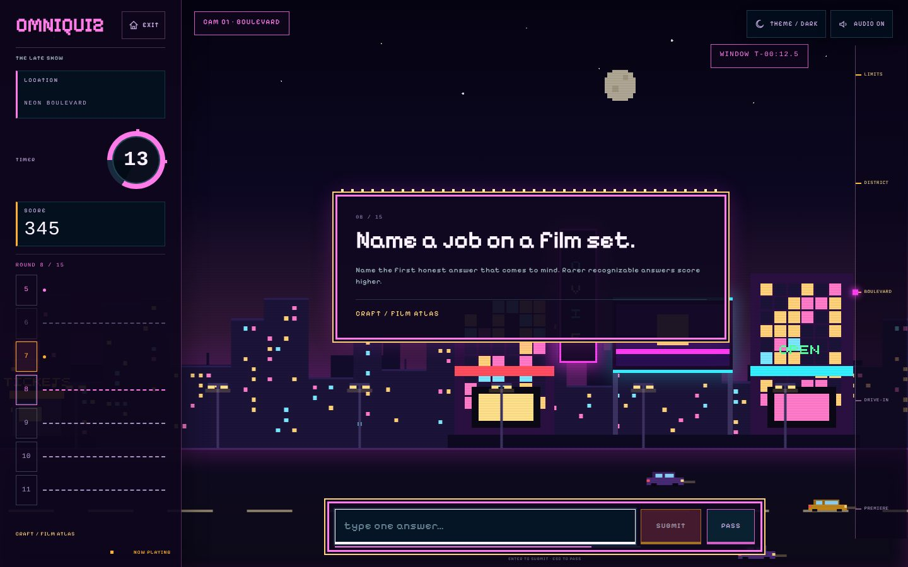
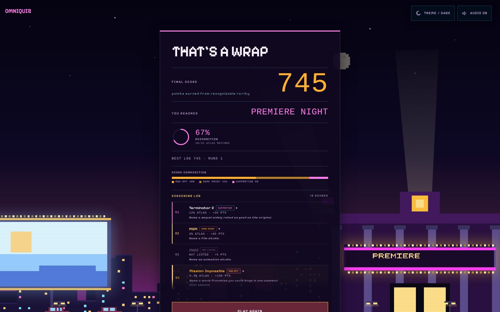

# OMNIQUIZ

A pixel-art trivia game where the *uncommon* answer wins. You get a deliberately broad prompt, type one honest answer, and the game reveals how common that answer is inside a curated answer atlas. Rarer, recognizable answers score more.

Each content pack is its own world. The core game is an ocean descent where good answers sink your submersible deeper; the Movies pack is a late-night drive from the city limits, past neon marquees and a drive-in, to a premiere night, with its own interface wording.

It is a free, account-free browser game with four game modes and themed content packs, built as a small full-stack TypeScript project: Next.js on Cloudflare Workers, deterministic scoring, and a server-side answer atlas that the browser never receives.

- **Play it locally:** see [Getting started](#getting-started).
- **Live demo:** [omniquiz-nine.vercel.app](https://omniquiz-nine.vercel.app), a deployment of the `main` branch.
- **Deployment:** the repository is configured for Cloudflare Workers (`npm run deploy`). See [Current status](#current-status).
- **Repository owner:** [@WhiteBlindness](https://github.com/WhiteBlindness).



| Choose a world | At the Movies, mid-run | At the Movies, arrival |
| --- | --- | --- |
|  |  |  |

## What it does

**Game modes** (how you play):

| Mode | Shape |
| --- | --- |
| Daily | Seven prompts, 15 seconds each, one deterministic set per UTC day |
| Unlimited (Arcade) | 15 prompts per run, replayable, different set each run |
| Speed Run | 10 prompts, 8 seconds each, streak multipliers (3 in a row = 2x, 5 = 3x) |
| Survival | Three lives, up to 30 prompts; a miss, pass or timeout costs a life |

**Content packs** (what you play *about*):

| Pack | Status | Modes |
| --- | --- | --- |
| Core (General, Science, Geography, History) | Live | All four |
| At the Movies | Live | Unlimited, Speed Run, Survival |
| Sports, Music | Planned, no content yet | None |

**Scoring** is deterministic and derived only from the matched answer's crowd share: at least 30% is Plankton (10 points), 18% Too Clever (15), 10% Schooler (30), 5% Rare Catch (60), 2% Deep Cut (85), below 2% One in a Krillion (100). Passing, timing out or typing something outside the atlas scores zero with no penalty. Every point adds 10 metres of depth.

## What is technically interesting

- **Modes and packs are separate axes.** `GameMode` lives in the reducer and game loop; a content pack is metadata plus an atlas. Adding a pack does not touch scoring, the reducer or the loop. `src/lib/packs/meta.ts` declares each pack's compatible modes, topics and presentation, and the API rejects unsupported pack/mode pairs.
- **The answer atlas never reaches the browser.** `/api/questions` returns only `{ id, category, prompt }`. `/api/submit` evaluates an answer server-side and reveals the matched label, share and the top three common answers only after submission. A contract test scans client code and route pages for any import of atlas data or the server catalog.
- **Bounded, explainable answer matching.** Case, accents, punctuation, leading articles and conservative singular/plural variants converge; there is no fuzzy or semantic matching, and expanded answer keys may not collide across families within a prompt. The validator enforces this when the catalog loads.
- **Atlases are compiled, deterministic data.** `scripts/atlas/` holds the maintainable sources; `node scripts/generate-questions.mjs` compiles `src/data/questions.json` and `src/data/packs/movies.json`. A test asserts the output is byte-stable.
- **Runs survive refreshes, and packs stay isolated.** Progress is restored from local storage with the pack recorded, so a Movies run can never be resumed inside a core route. Statistics are namespaced per pack.
- **Packs choose a world, not just content.** A pack names an environment; the environment supplies ordered stages, a complete interface lexicon and a backdrop renderer. The Movies backdrop is layered, script-generated SVG pixel art moved by one CSS variable for parallax, animating only `transform` and `opacity`, with ambient motion off under `prefers-reduced-motion`. Tests fail if ocean vocabulary appears on any Movies screen, including CSS-generated labels and answer insights.
- **Leaving a run is safe.** The logo and Exit share one guard: a confirmation appears only while a prompt is on screen, the run is saved locally, and returning offers to resume it.
- **Security headers via one proxy.** `src/proxy.ts` applies a same-origin Content-Security-Policy and hardening headers to every route in production, verified on both the Next.js server and the Cloudflare Workers runtime.
- **Time is measured against a deadline, not ticks.** The answer clock is an absolute deadline re-synced on visibility and focus, so a backgrounded tab cannot buy extra time.

## Architecture

```
Browser (React, Next.js app router)
  game reducer + useGameLoop         local storage: theme, sound, stats, current run
        |  GET /api/questions?mode=&pack=&run=|date=     POST /api/submit {questionId, answer}
        v
Cloudflare Worker (Next.js via vinext)
  src/proxy.ts            security headers
  src/app/api/*           validation, selection, evaluation
  src/lib/questions/      validated catalog, selection, normalization
  src/lib/game/scoring.ts crowd share -> tier -> points
  src/data/*.json         compiled atlases (server only)
```

There is no database, account system or external API. See [docs/architecture.md](docs/architecture.md) for the pack and environment contracts and how to add a pack or world, and [docs/content-sources.md](docs/content-sources.md) for where content comes from.

## Stack

Next.js 16 (app router), React 19, TypeScript, vinext + Wrangler for Cloudflare Workers, Vitest and Testing Library for unit and contract tests, Playwright for end-to-end tests. Fonts are self-hosted (`@fontsource-variable/pixelify-sans`); sound effects are synthesized with the Web Audio API.

## Getting started

Requires Node 22 (see `.node-version`).

```bash
npm install
npm run dev          # http://localhost:3000
```

## Verification

```bash
npx tsc --noEmit     # typecheck
npm run lint
npm test             # unit and contract tests
npm run build        # Next.js production build
npm run build:vinext # Cloudflare Workers build used by `npm run deploy`
npm run test:e2e     # Playwright, desktop and mobile Chromium
```

Set `BASE_URL` to point Playwright at an already-running server instead of starting one.

## Routes

- `/` — Daily
- `/unlimited/classic`, `/speed-run`, `/survival` — core modes (optional `?category=` for the core pack)
- `/packs` — themed packs
- `/packs/movies` — At the Movies (`?mode=speed` or `?mode=survival`)
- `/privacy`, `/terms`, `/cookies` — plain-language policies
- `POST /api/submit`, `GET /api/questions` — game API (same-origin only)

## Current status

- All four modes and the Movies pack are implemented and covered by unit, contract and end-to-end tests.
- A live demo of the `main` branch is linked above. The repository's deployment configuration targets Cloudflare Workers; which host serves the demo, and any custom domain, are not recorded here.
- Operator identity and contact details are not published in the Privacy Policy or Terms yet.

## Limitations

- **Answer shares are curated estimates, not live polling.** Within each prompt the answers are written in rough order of how commonly people name them, and a fixed set of share profiles is applied to that order. The in-game copy and the Terms say so.
- **Scores are computed in the browser from server results and kept in local storage.** There are no accounts, leaderboards or server-side score authority, so results are not tamper-proof and are not comparable between players.
- **Free-text matching is deliberately strict.** A correct answer phrased in a way the atlas does not list scores as uncharted.
- **English only.** There is no localisation layer.
- **Sports and Music packs are placeholders** on the packs page; they have no content yet.
- **Short landscape phones are cramped.** Around 390px of height, the prompt heading scrolls out of view while the answer field has focus, in every world.
- Some small pixel-font text elsewhere in the interface is below comfortable reading size; see `docs/release-readiness.md`.
